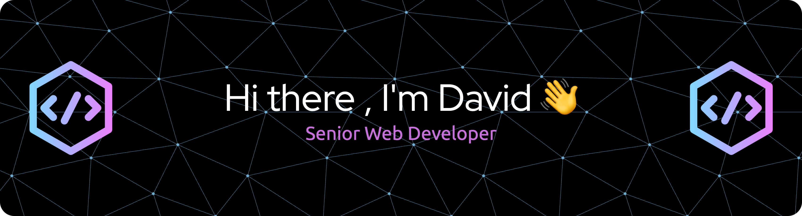

### About Me

I'm a **Senior Web Developer** with 6+ years of experience dedicated to building and optimizing robust, high-performance digital experiences. My specialization lies in crafting accessible, user-centric websites, with a strong focus on static-rendered architectures. I thrive on transforming complex concepts and design mockups into seamless, intuitive web solutions.

---

### My Toolkit 🛠️

Here are some of the technologies and tools I frequently work with:

* **Languages:** JavaScript (ESNext), TypeScript, HTML, CSS
* **Frameworks & Libraries:** AstroJS, HugoSSG, 11ty
* **Styling:** TailwindCSS, CSS Modules, Styled Components
* **CMS:** DatoCMS
* **Search:** Typesense, Algolia
* **Deployment & Cloud:** AWS Amplify, GitHub Pages, GitLab
* **Version Control:** Git, GitHub

---

### What I'm Passionate About

Beyond the code, I'm deeply committed to **web performance, accessibility, and maintainability**. I believe in creating products that are not just visually appealing, but also inclusive, efficient, and sustainable for the long term. I'm a calm, collaborative communicator who values **diversity** in teams and enjoys leading projects, mentoring teammates, and leading by example to achieve significant improvements in team goals and missions. My own aim is to always deliver high-quality, impactful web solutions that truly serve their users.

---

### Let's Connect! 🤝

I'm always open to discussing new projects, collaborating, or sharing insights. Feel free to reach out!

* **LinkedIn:** https://www.linkedin.com/in/david-weid/
* **Portfolio:** https://davids-place-portfolio.web.app/
* **Email:** david.weid.2@gmail.com
* **PDF Resume:** [david-weid-resume-2025.pdf](https://github.com/user-attachments/files/21803850/david-weid-resume-2025.pdf)

---

Header image above generated from [this Github Profile Header Generator](https://leviarista.github.io/github-profile-header-generator/)
